# Effectiveness and Cost of Error Mitigation on Noisy Quantum Circuits

**Group 20**

| Member | USN |
|---|---|
| TBD | TBD |
| TBD | TBD |
| TBD | TBD |
| TBD | TBD |

> This file is generated by `scripts/build_report.py` from `report/report_template.md`. Every result number in it is read from files produced by the analysis code; none is typed by hand.

## Abstract

We ask whether simple error-mitigation methods improve the output of a noisy quantum circuit, and at what cost. A layered ry–rz–CNOT circuit (2, 4, 6 qubits; 2, 4 layers) is simulated in Qiskit Aer under depolarizing gate noise plus readout error at three levels (ideal, low, moderate), with 5 random instances per size and 1024 shots per circuit. Four methods post-process identical raw data: no mitigation, readout error mitigation (REM) with a full calibration matrix, zero-noise extrapolation (ZNE) by global folding with Richardson extrapolation, and the two combined. At moderate noise every method lowers the parity error: the median improvement is 43% for REM, 46% for ZNE and 65% for the combination, which is the most accurate method in 4/6 circuit sizes. At low noise REM is the most accurate method in 5/6 sizes, while ZNE alone gives no significant gain (pooled Wilcoxon p = 0.067). The costs differ sharply. REM needs 1 + 2ⁿ circuits (65 at n = 6). ZNE needs 3 circuits but 9 times the CNOTs and 5 times the depth, and it multiplies the shot-noise standard deviation by a measured 2.53. Mitigation reduces the bias of expectation values; it does not correct individual shots.

## 1. Introduction and background

### 1.1 Noise on NISQ devices

Present quantum processors have too few qubits for error correction, so every gate and every measurement is imperfect. Two error sources dominate simple experiments: **gate errors**, where an operation is followed by an unwanted perturbation of the state, and **readout errors**, where a qubit in |0⟩ is reported as 1 or vice versa. Both bias expectation values. For the global parity observable used here, any error that flips a qubit's Z eigenvalue flips the measured parity, so both sources shrink it toward zero.

### 1.2 Mitigation is not correction

Error *correction* encodes logical qubits in many physical ones and fixes errors shot by shot. Error *mitigation* needs no extra qubits: it runs additional circuits and post-processes the results classically to reduce the **bias of an expectation value**. Individual shots stay noisy, and the price is paid in extra circuits, extra shots and usually extra statistical variance.

### 1.3 Depolarizing gate noise

Qiskit's `depolarizing_error(λ, k)` on k qubits is the channel

  E(ρ) = (1 − λ) ρ + λ · Tr(ρ) · I / 2ᵏ,

so with probability λ the state is replaced by the maximally mixed state; equivalently a uniformly random non-identity Pauli is applied with probability λ(4ᵏ − 1)/4ᵏ. A traceless observable such as a Pauli string is multiplied by (1 − λ) each time the channel acts on its support, so the noisy parity decays toward zero roughly exponentially in the number of gates.

### 1.4 Readout error and the assignment matrix

Readout error is described by an assignment matrix A with A[i, j] = P(measure i | prepare j); each column sums to 1. The measured distribution is p̃ = A p. For independent symmetric flips with probability p on each of n qubits, A = A₁^{⊗n} with A₁ = [[1−p, p], [p, 1−p]], and the n-qubit parity is multiplied by exactly (1 − 2p)ⁿ.

### 1.5 Readout error mitigation (REM)

REM estimates A by preparing each of the 2ⁿ basis states and measuring, then inverts it: q = A⁻¹ p̃. The vector q sums to 1 but can have negative entries (a *quasi-probability* vector) because both A and p̃ are estimated from finite shots. Expectation values are linear in q, so they are taken from q directly. Where a proper distribution is needed (fidelity, total variation distance), q is projected onto the probability simplex by Euclidean projection. REM removes readout bias only; gate errors before the measurement are untouched.

### 1.6 Zero-noise extrapolation (ZNE)

ZNE runs the circuit at amplified noise levels and extrapolates back to zero noise. Global unitary folding replaces U by U(U†U)ᵏ, which is the same unitary but applies every gate 2k + 1 = λ times, so gate noise is scaled by λ ∈ {1, 3, 5}. Richardson extrapolation fits the unique quadratic through the three points and evaluates it at λ = 0:

  E₀ = Σᵢ γᵢ E(λᵢ),  γᵢ = Πⱼ≠ᵢ λⱼ / (λⱼ − λᵢ),  γ = (15/8, −5/4, 3/8) for λ = (1, 3, 5).

Because the coefficients are large and of mixed sign, the shot-noise standard deviation of E₀ is about √(Σγᵢ²) = √5.22 ≈ 2.28 times that of a single run. Measurements are not folded, so readout error is *not* amplified and ZNE alone cannot remove it; this motivates combining ZNE with REM.

## 2. Methodology

### 2.1 Circuit

Each instance has n qubits and L layers. A layer applies ry(θ) to every qubit, rz(φ) to every qubit, then a CNOT chain cx(0,1), cx(1,2), …, cx(n−2, n−1). Angles are uniform on [0, 2π). The primary observable is the parity ⟨Z⊗…⊗Z⟩; the mean single-qubit magnetization is recorded as a secondary observable.

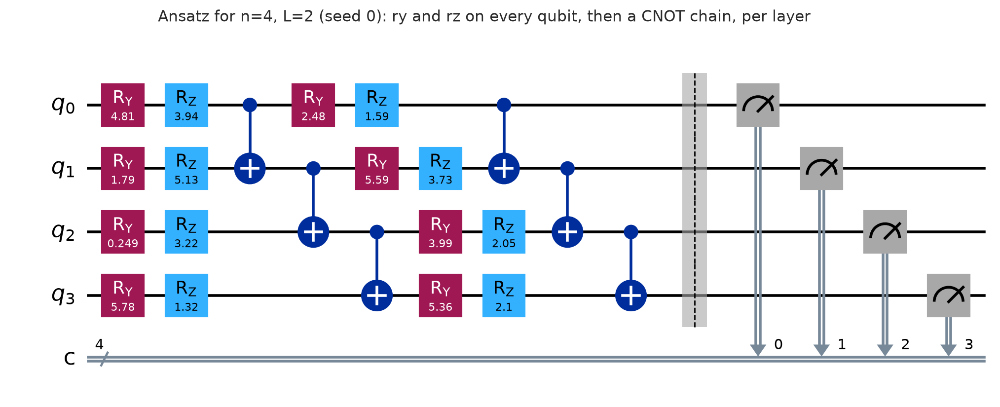

*Figure 0. The ansatz for n = 4, L = 2 (instance seed 0), with the barrier and measurements added before execution.*

| n | L | 1-qubit gates | CNOTs |
|---|---|---|---|
| 2 | 2 | 8 | 2 |
| 2 | 4 | 16 | 4 |
| 4 | 2 | 16 | 6 |
| 4 | 4 | 32 | 12 |
| 6 | 2 | 24 | 10 |
| 6 | 4 | 48 | 20 |

**Instance selection.** A random parity is often close to zero, where noise and mitigation effects disappear under shot noise and relative errors are undefined. Angles are therefore redrawn from a seeded stream until |E_exact| ≥ 0.3. Over the 30 instances this took a median of 2 and at most 35 draws, and the selected |E_exact| range from 0.311 to 0.872. This rule is a selection bias (Section 5.4).

### 2.2 Noise levels

| Level | p1 (1-qubit depolarizing, on ry and rz) | p2 (2-qubit depolarizing, on cx) | p_ro (readout flip) |
|---|---|---|---|
| ideal | 0 | 0 | 0 |
| low | 0.001 | 0.01 | 0.01 |
| moderate | 0.005 | 0.03 | 0.03 |

All circuits are transpiled to {ry, rz, cx} at optimization level 0 (higher levels would cancel the folds), and the executor rejects any circuit containing another gate, because the noise model attaches errors by gate name.

### 2.3 Methods

- **none**: the parity of the base circuit's counts.
- **rem**: full 2ⁿ-state calibration (basis states prepared with ry(π), which picks up the same 1-qubit noise a real preparation would), then inversion of A; expectation from the unprojected quasi-probabilities.
- **zne**: base circuit plus globally folded circuits at λ = 3 and 5; Richardson extrapolation (linear and exponential fits are recorded as secondary extrapolators).
- **zne_rem**: REM applied to the counts at every λ with the same calibration matrix, then Richardson extrapolation.

ZNE produces only an extrapolated number, not a distribution, so distribution metrics are reported for `none` and `rem` only.

### 2.4 Metrics

- **Error**: |E_hat − E_exact| against the exact noiseless parity from the statevector, plus signed and relative error.
- **Improvement**: 100·(1 − err/err_none) and the reduction factor err_none/err, both against `none` on the same counts.
- **Distribution quality**: Hellinger fidelity (Σₓ √(pₓqₓ))² and total variation distance ½Σₓ|pₓ − qₓ| against the exact distribution.
- **Shot-noise floor**: √((1 − E_exact²)/1024).
- **Overhead**: circuit executions, total shots, the largest executed depth, total CNOTs and wall time per estimate.
- **Bias diagnostics**: the exact noisy parity `E_noisy_exact` from a noise-model density-matrix simulation with the true readout matrix applied, so each method's bias can be separated from shot noise.

Results are aggregated over the 5 seeds with the mean, standard deviation, median and a 95% Student-t interval.

### 2.5 Grid, seeds and pairing

The grid is n ∈ {2, 4, 6} × L ∈ {2, 4} × three noise levels × seeds 0–4, giving 90 conditions and 360 method rows. Every random number comes from a SHA-256 seed derived from its purpose. The circuit instance depends only on (n, L, seed), so the same circuit is used at every noise level. All four methods post-process the *same* base counts, and `zne` and `zne_rem` share the same folded counts. Method differences therefore come from the mitigation alone, which is what makes the paired tests below valid. Calibration is repeated for every condition so that its cost is counted each time. Running the sweep twice reproduces every non-timing value of `runs.csv` and every raw file byte for byte.

### 2.6 Software

Python 3.11.15, Qiskit 2.5.2, Qiskit Aer 0.17.2, NumPy 2.4.6, SciPy 1.17.1, pandas 3.0.6, Matplotlib 3.11.2. The full list is in `results/environment.txt`.

## 3. Results

### 3.1 Error before and after mitigation

Absolute error |E_hat − E_exact| of the parity, mean ± std over 5 seeds. The lowest mean per (n, L, noise level) is in bold. At the ideal level the error is pure shot noise.

| n | L | ideal / none | ideal / rem | ideal / zne | ideal / zne_rem | low / none | low / rem | low / zne | low / zne_rem | moderate / none | moderate / rem | moderate / zne | moderate / zne_rem |
| ---: | ---: | ---: | ---: | ---: | ---: | ---: | ---: | ---: | ---: | ---: | ---: | ---: | ---: |
| 2 | 2 | **0.018 ± 0.021** | 0.018 ± 0.021 | 0.058 ± 0.066 | 0.058 ± 0.066 | 0.047 ± 0.029 | **0.028 ± 0.020** | 0.048 ± 0.024 | 0.029 ± 0.025 | 0.119 ± 0.044 | **0.044 ± 0.045** | 0.052 ± 0.051 | 0.074 ± 0.057 |
| 2 | 4 | **0.026 ± 0.021** | 0.026 ± 0.021 | 0.053 ± 0.041 | 0.053 ± 0.041 | 0.047 ± 0.029 | **0.031 ± 0.016** | 0.068 ± 0.027 | 0.058 ± 0.043 | 0.128 ± 0.030 | 0.071 ± 0.025 | **0.036 ± 0.033** | 0.038 ± 0.024 |
| 4 | 2 | **0.016 ± 0.011** | 0.016 ± 0.011 | 0.051 ± 0.016 | 0.051 ± 0.016 | 0.099 ± 0.027 | **0.058 ± 0.034** | 0.090 ± 0.054 | 0.058 ± 0.044 | 0.199 ± 0.074 | 0.110 ± 0.047 | 0.134 ± 0.069 | **0.060 ± 0.020** |
| 4 | 4 | **0.013 ± 0.009** | 0.013 ± 0.009 | 0.042 ± 0.042 | 0.042 ± 0.042 | 0.078 ± 0.028 | **0.048 ± 0.026** | 0.054 ± 0.037 | 0.062 ± 0.035 | 0.213 ± 0.040 | 0.151 ± 0.031 | 0.109 ± 0.038 | **0.048 ± 0.022** |
| 6 | 2 | **0.027 ± 0.026** | 0.027 ± 0.026 | 0.053 ± 0.046 | 0.053 ± 0.046 | 0.071 ± 0.019 | **0.027 ± 0.017** | 0.053 ± 0.009 | 0.049 ± 0.054 | 0.185 ± 0.022 | 0.097 ± 0.025 | 0.087 ± 0.040 | **0.059 ± 0.040** |
| 6 | 4 | **0.027 ± 0.011** | 0.027 ± 0.011 | 0.049 ± 0.031 | 0.049 ± 0.031 | 0.113 ± 0.028 | 0.080 ± 0.028 | 0.069 ± 0.060 | **0.068 ± 0.027** | 0.242 ± 0.055 | 0.180 ± 0.058 | 0.164 ± 0.088 | **0.117 ± 0.030** |

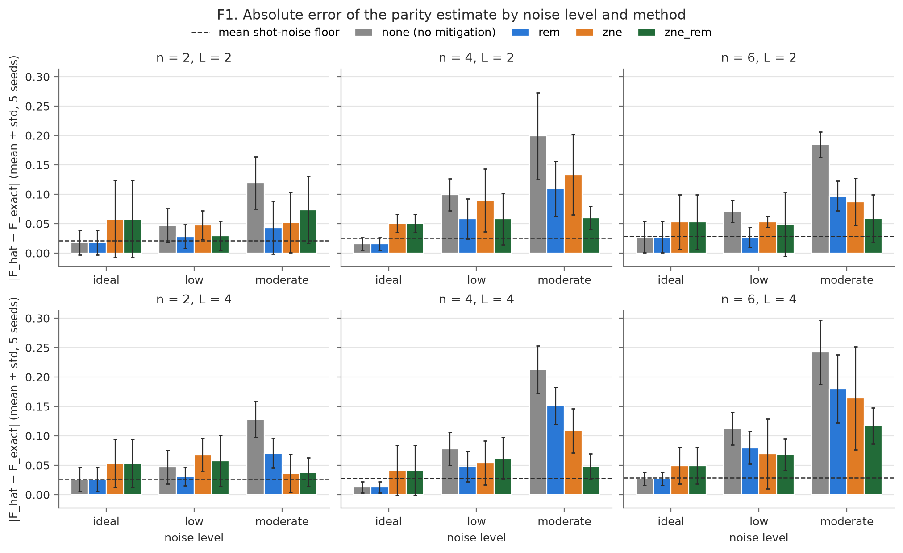

*F1. Mean absolute error by noise level, method and circuit size; the dashed line is the mean shot-noise floor.* Without mitigation, the error rises from 0.021 (ideal; shot noise only) to 0.076 (low) and 0.181 (moderate), pooled over all sizes. At moderate noise every mitigated method sits well below the baseline, and `zne_rem` is lowest in most panels. At the ideal level REM leaves the error unchanged, while the ZNE methods raise it to 2.4 times the baseline.

Median over 5 seeds of 100·(1 − |err| / |err_none|), in percent; negative values mean the method made the estimate worse. † At the ideal level the baseline error is pure shot noise, so these values are unstable and excluded from headline numbers.

| n | L | ideal / rem | ideal / zne | ideal / zne_rem | low / rem | low / zne | low / zne_rem | moderate / rem | moderate / zne | moderate / zne_rem |
| ---: | ---: | ---: | ---: | ---: | ---: | ---: | ---: | ---: | ---: | ---: |
| 2 | 2 | 0 † | -210 † | -210 † | 34 | -4 | 26 | 82 | 74 | 26 |
| 2 | 4 | 0 † | -102 † | -102 † | 36 | 4 | 37 | 48 | 67 | 68 |
| 4 | 2 | 0 † | -302 † | -302 † | 38 | 24 | 61 | 44 | 25 | 66 |
| 4 | 4 | 0 † | -148 † | -148 † | 42 | 30 | 41 | 28 | 43 | 70 |
| 6 | 2 | 0 † | -128 † | -128 † | 63 | 31 | 69 | 46 | 66 | 56 |
| 6 | 4 | 0 † | -57 † | -57 † | 26 | 29 | 34 | 25 | 26 | 58 |

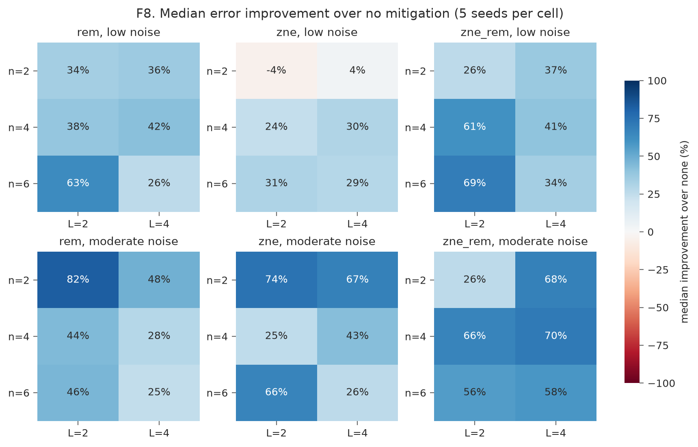

*F8. Median improvement per (n, L).* REM improves every noisy cell. ZNE alone gains little at low noise for n = 2 but helps substantially at moderate noise. `zne_rem` is the most consistent: its median improvement at moderate noise is 65% at L = 2 and 65% at L = 4.

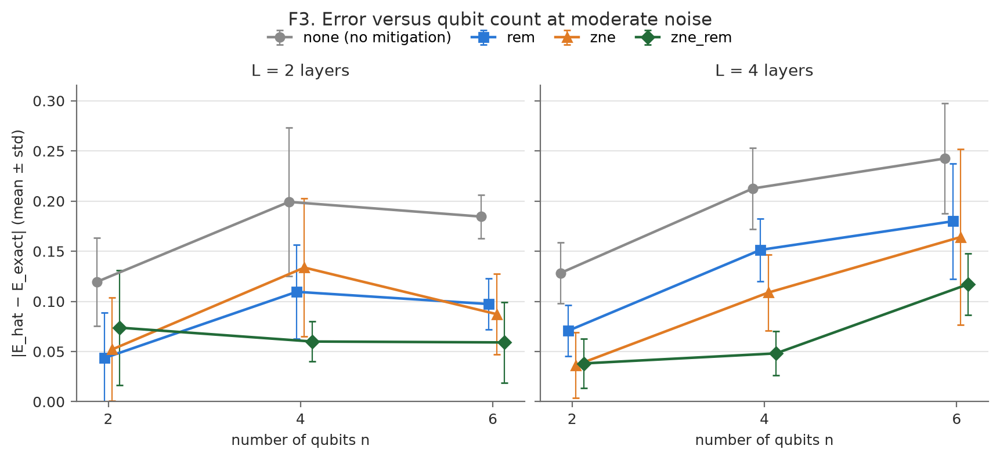

*F3. Error versus qubit count at moderate noise.* Errors of all methods grow with n, more clearly at L = 4. At L = 4 every mitigated method is below the baseline for every n, and `zne_rem` is lowest for n = 4 and 6 (at n = 2 it ties with `zne`). At L = 2 the picture is less regular and the error bars overlap.

**Statistical tests** (`results/summary/stats_tests.csv`). Pooled over the 30 paired runs per noise level (two-sided Wilcoxon signed-rank on the absolute errors):

| method | low: mean change in error | low: p | moderate: mean change in error | moderate: p |
|---|---:|---:|---:|---:|
| rem | -0.031 | 1.3e-08 | -0.072 | 1.9e-09 |
| zne | -0.012 | 0.067 | -0.084 | 1.9e-09 |
| zne_rem | -0.022 | 0.028 | -0.115 | 2.6e-08 |

Per condition (5 seeds), a paired t-test is used, because a Wilcoxon test on 5 pairs cannot reach p < 0.05 (its smallest two-sided p is 0.0625). The number of the 6 (n, L) conditions where the method's error is significantly lower (p < 0.05) is 4/6 (rem), 0/6 (zne) and 2/6 (zne_rem) at low noise, and 6/6, 6/6 and 5/6 at moderate noise.

### 3.2 Output distributions

Computed against the exact noiseless distribution, mean ± std over 5 seeds. ZNE produces no distribution, so `zne` and `zne_rem` have no entries by design.

**Hellinger fidelity (higher is better)**

| n | L | ideal / none | ideal / rem | low / none | low / rem | moderate / none | moderate / rem |
| ---: | ---: | ---: | ---: | ---: | ---: | ---: | ---: |
| 2 | 2 | 0.999 ± 0.001 | 0.999 ± 0.001 | 0.997 ± 0.002 | 0.999 ± 0.001 | 0.980 ± 0.013 | 0.992 ± 0.007 |
| 2 | 4 | 0.999 ± 0.000 | 0.999 ± 0.000 | 0.997 ± 0.002 | 0.998 ± 0.001 | 0.989 ± 0.005 | 0.995 ± 0.003 |
| 4 | 2 | 0.996 ± 0.001 | 0.996 ± 0.001 | 0.986 ± 0.005 | 0.991 ± 0.004 | 0.954 ± 0.024 | 0.977 ± 0.015 |
| 4 | 4 | 0.997 ± 0.001 | 0.997 ± 0.001 | 0.987 ± 0.002 | 0.990 ± 0.002 | 0.951 ± 0.008 | 0.966 ± 0.005 |
| 6 | 2 | 0.981 ± 0.004 | 0.981 ± 0.004 | 0.971 ± 0.006 | 0.974 ± 0.004 | 0.931 ± 0.013 | 0.953 ± 0.008 |
| 6 | 4 | 0.981 ± 0.003 | 0.981 ± 0.003 | 0.965 ± 0.003 | 0.969 ± 0.003 | 0.906 ± 0.014 | 0.924 ± 0.010 |

**Total variation distance (lower is better)**

| n | L | ideal / none | ideal / rem | low / none | low / rem | moderate / none | moderate / rem |
| ---: | ---: | ---: | ---: | ---: | ---: | ---: | ---: |
| 2 | 2 | 0.020 ± 0.013 | 0.020 ± 0.013 | 0.031 ± 0.007 | 0.021 ± 0.004 | 0.077 ± 0.029 | 0.047 ± 0.028 |
| 2 | 4 | 0.019 ± 0.011 | 0.019 ± 0.011 | 0.034 ± 0.010 | 0.026 ± 0.009 | 0.071 ± 0.011 | 0.044 ± 0.008 |
| 4 | 2 | 0.036 ± 0.012 | 0.036 ± 0.012 | 0.076 ± 0.014 | 0.062 ± 0.008 | 0.139 ± 0.031 | 0.091 ± 0.027 |
| 4 | 4 | 0.034 ± 0.005 | 0.034 ± 0.005 | 0.078 ± 0.008 | 0.068 ± 0.008 | 0.159 ± 0.022 | 0.125 ± 0.016 |
| 6 | 2 | 0.070 ± 0.014 | 0.070 ± 0.014 | 0.103 ± 0.008 | 0.093 ± 0.007 | 0.184 ± 0.013 | 0.142 ± 0.009 |
| 6 | 4 | 0.085 ± 0.011 | 0.085 ± 0.011 | 0.122 ± 0.006 | 0.111 ± 0.007 | 0.236 ± 0.026 | 0.203 ± 0.027 |

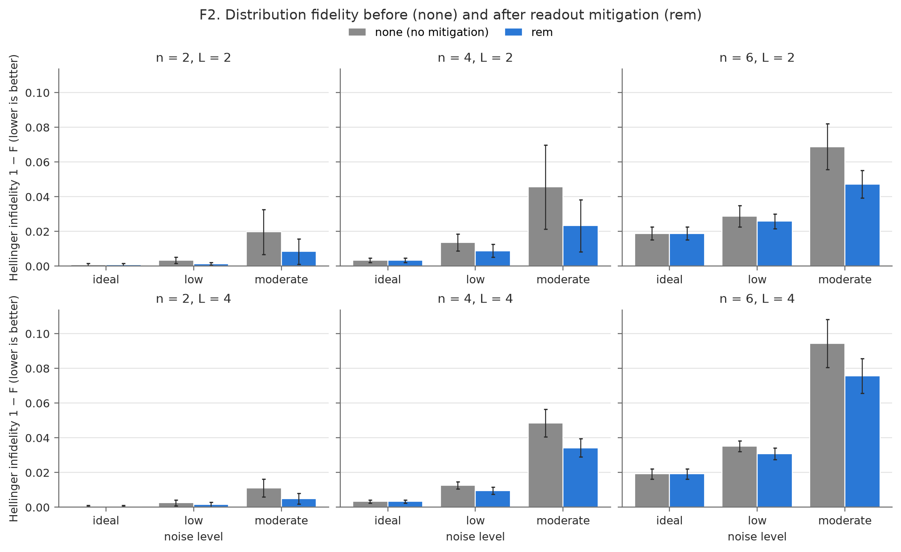

*F2. Hellinger infidelity (1 − F) before and after REM.* REM lowers the infidelity in every noisy cell. The improvement is largest at moderate noise. The remaining infidelity grows with n because it comes from gate noise, which REM does not address.

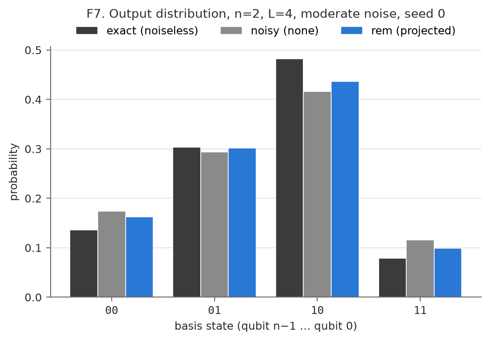
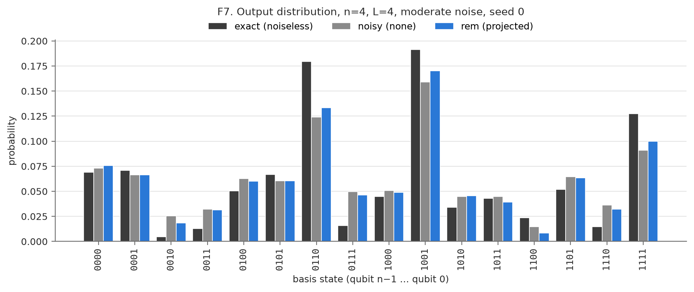
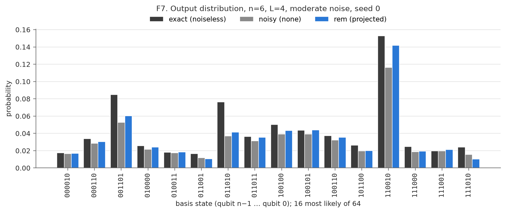

*F7. Exact, noisy and REM-corrected distributions (moderate noise, L = 4, seed 0).* Noise flattens the distribution: probable states lose weight and improbable states gain it. REM restores part of the lost weight on the dominant states, but a clear gap to the exact distribution remains, again the gate-noise share.

### 3.3 Zero-noise extrapolation in detail

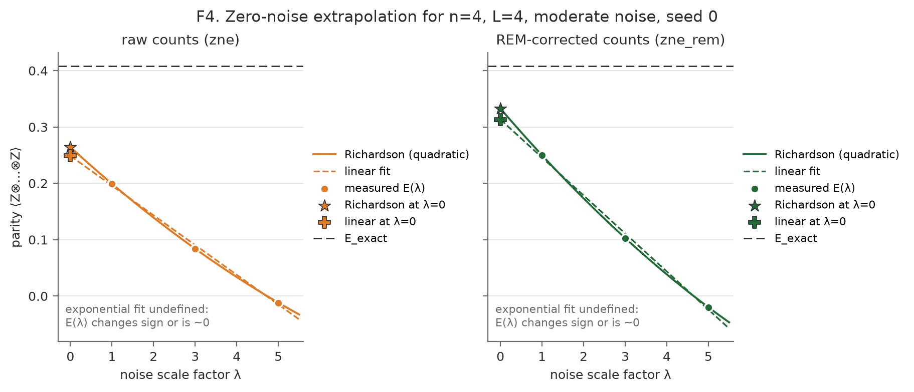

*F4. The example condition (n = 4, L = 4, moderate noise, seed 0).* The measured parity falls almost linearly with λ and is close to zero by λ = 5 (slightly negative here, so the exponential fit is undefined). Both extrapolations move the estimate toward E_exact. The REM-corrected points start higher because readout attenuation is removed at every λ, and their extrapolation lands closer, though still short of E_exact.

Mean absolute error of each extrapolator at the noisy levels, pooled over L and seeds (`all` pools n too). The exp error averages only the fits that succeeded.

| noise | method | n | runs | Richardson \|err\| | linear \|err\| | exp \|err\| (valid fits) | Richardson out of [−1, 1] | exp fit failed (NaN) |
| --- | --- | --- | ---: | ---: | ---: | ---: | ---: | ---: |
| low | zne | 2 | 10 | 0.058 | 0.034 | 0.033 | 0 | 0 |
| low | zne | 4 | 10 | 0.072 | 0.062 | 0.061 | 0 | 0 |
| low | zne | 6 | 10 | 0.061 | 0.064 | 0.045 | 0 | 0 |
| low | zne | all | 30 | 0.064 | 0.053 | 0.047 | 0 | 0 |
| low | zne_rem | 2 | 10 | 0.044 | 0.025 | 0.028 | 0 | 0 |
| low | zne_rem | 4 | 10 | 0.060 | 0.035 | 0.042 | 0 | 0 |
| low | zne_rem | 6 | 10 | 0.059 | 0.028 | 0.043 | 0 | 0 |
| low | zne_rem | all | 30 | 0.054 | 0.029 | 0.038 | 0 | 0 |
| moderate | zne | 2 | 10 | 0.044 | 0.088 | 0.070 | 0 | 0 |
| moderate | zne | 4 | 10 | 0.121 | 0.170 | 0.135 | 0 | 1 |
| moderate | zne | 6 | 10 | 0.126 | 0.198 | 0.156 | 0 | 1 |
| moderate | zne | all | 30 | 0.097 | 0.152 | 0.119 | 0 | 2 |
| moderate | zne_rem | 2 | 10 | 0.056 | 0.038 | 0.042 | 1 | 0 |
| moderate | zne_rem | 4 | 10 | 0.054 | 0.084 | 0.083 | 0 | 1 |
| moderate | zne_rem | 6 | 10 | 0.088 | 0.116 | 0.079 | 0 | 1 |
| moderate | zne_rem | all | 30 | 0.066 | 0.079 | 0.067 | 1 | 2 |

Residuals of each estimate against its own exact infinite-shot value (density-matrix simulation of the base and folded circuits), so they contain shot noise only. The predicted ratio is the mean of zne_std / est_std(none); the theoretical value at E = 0 is √5.22 ≈ 2.28. The last two columns are the error ZNE would leave with unlimited shots: as run, and with the exact readout attenuation (1 − 2p_ro)ⁿ divided out, which isolates the extrapolation error on gate noise alone.

| noise | runs | RMS shot residual none | RMS shot residual zne | empirical std ratio | predicted std ratio | zne \|err\|, infinite shots | zne \|err\|, infinite shots, readout removed |
| --- | ---: | ---: | ---: | ---: | ---: | ---: | ---: |
| ideal | 30 | 0.0270 | 0.0641 | 2.38 | 2.29 | 0.0000 | 0.0000 |
| low | 30 | 0.0270 | 0.0609 | 2.26 | 2.31 | 0.0358 | 0.0014 |
| moderate | 30 | 0.0215 | 0.0542 | 2.53 | 2.32 | 0.1142 | 0.0236 |

### 3.4 Where the bias comes from

Infinite-shot bias of the unmitigated parity, from the exact noisy density matrix (`E_noisy_exact`), split exactly into gate-noise and readout parts. Mean over 5 seeds.

| n | L | noise | total \|bias\| | gate part | readout part | readout share |
| ---: | ---: | --- | ---: | ---: | ---: | ---: |
| 2 | 2 | low | 0.044 | 0.017 | 0.027 | 60% |
| 2 | 2 | moderate | 0.131 | 0.058 | 0.073 | 56% |
| 2 | 4 | low | 0.045 | 0.026 | 0.019 | 43% |
| 2 | 4 | moderate | 0.134 | 0.083 | 0.051 | 38% |
| 4 | 2 | low | 0.072 | 0.032 | 0.040 | 55% |
| 4 | 2 | moderate | 0.196 | 0.098 | 0.098 | 50% |
| 4 | 4 | low | 0.081 | 0.053 | 0.028 | 35% |
| 4 | 4 | moderate | 0.210 | 0.151 | 0.058 | 28% |
| 6 | 2 | low | 0.077 | 0.038 | 0.039 | 50% |
| 6 | 2 | moderate | 0.195 | 0.112 | 0.082 | 42% |
| 6 | 4 | low | 0.102 | 0.067 | 0.034 | 34% |
| 6 | 4 | moderate | 0.237 | 0.179 | 0.059 | 25% |

### 3.5 Bias versus variance

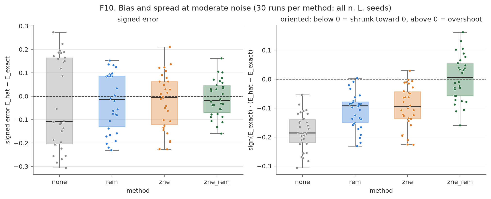

*F10. Signed error at moderate noise (30 runs per method).* The left panel mixes instances with positive and negative E_exact. In the right panel each error is oriented by the sign of E_exact, so values below zero mean the estimate was shrunk toward zero. The baseline is shrunk in every run. REM and ZNE each remove part of the shrinkage but stay biased below zero. `zne_rem` is centred near zero but is spread over a wider range of signed errors than REM, the variance cost of extrapolation.

### 3.6 Noiseless sanity check

At the ideal level the calibration matrix is exactly the identity, and REM changes no estimate: the largest |E_rem − E_none| over the 30 ideal runs is 0. ZNE, with no noise to remove, only amplifies shot noise. Its error is larger than the baseline's in 26/30 runs, and its mean error is 2.4 times the baseline's (median "improvement" -143%). The noiseless 1024-shot reference differs from E_exact by 0.020 on average, consistent with the mean shot-noise floor of 0.027.

### 3.7 Overhead

Executions and shots needed for one mitigated estimate, the largest executed depth relative to the base circuit (range over L), and total CNOTs executed relative to the base circuit. Calibration circuits contain no CNOTs.

| method | n=2 circuits | n=2 shots | n=2 max/base depth | n=2 total/base CX | n=4 circuits | n=4 shots | n=4 max/base depth | n=4 total/base CX | n=6 circuits | n=6 shots | n=6 max/base depth | n=6 total/base CX |
| --- | ---: | ---: | ---: | ---: | ---: | ---: | ---: | ---: | ---: | ---: | ---: | ---: |
| none | 1 | 1024 | 1.00 | 1 | 1 | 1024 | 1.00 | 1 | 1 | 1024 | 1.00 | 1 |
| rem | 5 | 5120 | 1.00 | 1 | 17 | 17408 | 1.00 | 1 | 65 | 66560 | 1.00 | 1 |
| zne | 3 | 3072 | 5.00 | 9 | 3 | 3072 | 5.00 | 9 | 3 | 3072 | 5.00 | 9 |
| zne_rem | 7 | 7168 | 5.00 | 9 | 19 | 19456 | 5.00 | 9 | 67 | 68608 | 5.00 | 9 |

**Wall time per estimate**

Simulator time of the circuits a method needs and classical post-processing time, averaged over L, noise levels and seeds. Simulator time is not hardware time.

| method | n=2 quantum (s) | n=4 quantum (s) | n=6 quantum (s) | n=2 classical (ms) | n=4 classical (ms) | n=6 classical (ms) |
| --- | ---: | ---: | ---: | ---: | ---: | ---: |
| none | 0.0026 | 0.0037 | 0.0058 | 0.035 | 0.047 | 0.081 |
| rem | 0.0094 | 0.0369 | 0.1703 | 0.157 | 0.268 | 0.819 |
| zne | 0.0095 | 0.0148 | 0.0312 | 0.232 | 0.280 | 0.375 |
| zne_rem | 0.0162 | 0.0480 | 0.1957 | 0.340 | 0.517 | 1.419 |

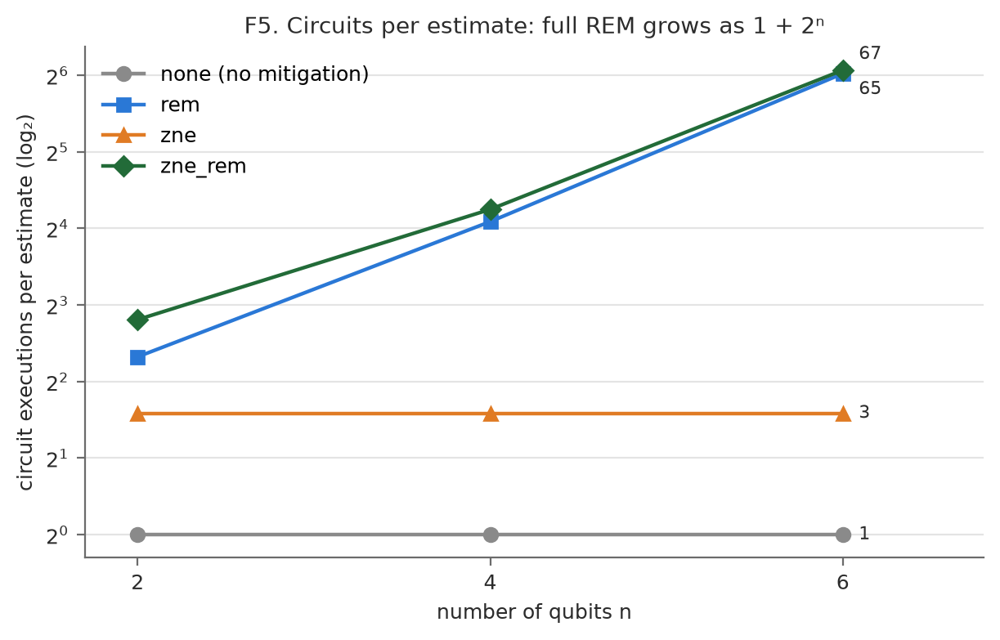

*F5. Circuits per estimate on a log₂ axis.* Full REM follows 1 + 2ⁿ exactly; ZNE is constant at 3.

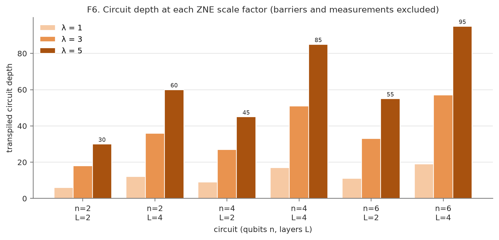

*F6. Transpiled depth at λ = 1, 3, 5.* Folded depth is exactly λ times the base depth for every circuit, reaching a depth of 95 for n = 6, L = 4 at λ = 5.

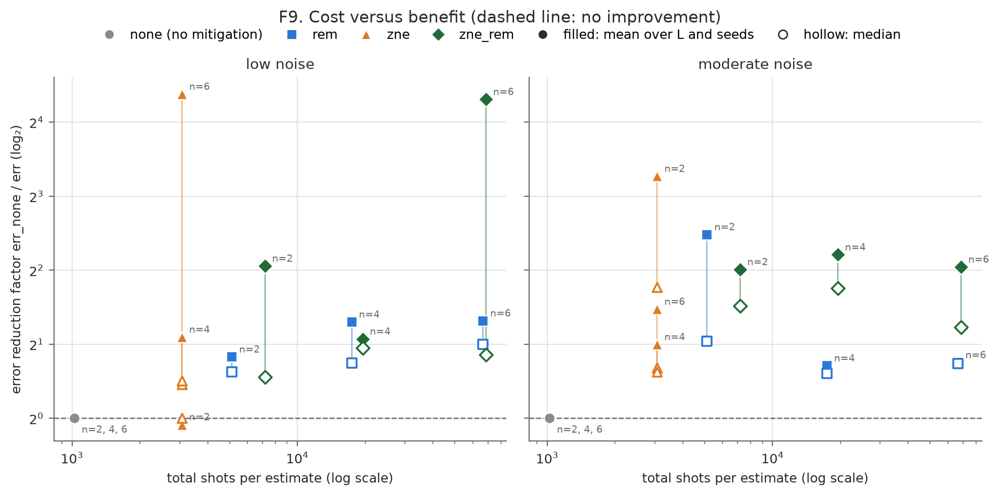

*F9. Error reduction versus shots per estimate.* Filled markers are means and hollow markers medians; the gap shows how a few runs with near-zero error inflate the mean. REM's cost rises steeply with n while its benefit does not. ZNE's cost is flat in shots, but its gains at low noise are small and not significant.

## 4. Answers to the research questions

**Q1. Does each method reduce error at the low and moderate noise levels, and by how much?** At moderate noise, yes for all three. Median improvements are 43% (rem), 46% (zne) and 65% (zne_rem). The error went down in 30/30, 30/30 and 29/30 runs respectively (pooled Wilcoxon p = 1.9e-09, 1.9e-09 and 2.6e-08; Section 3.1). At low noise, REM improves the median by 40% (28/30 runs, p = 1.3e-08) and `zne_rem` by 39% (p = 0.028). ZNE alone improves the median by only 12% and is not significant (p = 0.067). Evidence: `table_improvement`, F1, F8, `stats_tests.csv`.

**Q2. How does effectiveness change with qubit count and depth?** Unmitigated error grows with both. At moderate noise it is 0.124, 0.206 and 0.214 for n = 2, 4, 6, and 0.168 versus 0.194 for L = 2 versus 4. The share each method removes behaves differently:

- **REM** loses effectiveness with depth: median improvement at moderate noise falls from 46% at L = 2 to 28% at L = 4, because deeper circuits carry more gate noise, which REM cannot touch (Q3).
- **ZNE** loses effectiveness with qubit count: at moderate noise it improves the median by 70%, 37% and 35% for n = 2, 4, 6. Larger circuits decay faster: the λ = 5 run keeps on average 46%, 17% and 10% of the exact parity. The extrapolation therefore leans on points near the shot-noise floor, and the quadratic fits the faster decay less well.
- **zne_rem** is the most stable, with a median improvement of 65%, 70% and 57% at moderate noise.

Absolute errors after mitigation still grow with n and L (F3). Evidence: F3, F8, `table_error`, `table_improvement`.

**Q3. Which error source dominates, readout or gate noise?** Neither everywhere. The exact bias split (`table_bias_sources`) attributes 46% of the unmitigated bias to readout at low noise and 40% at moderate noise. At L = 2 the two sources are about equal (readout share 49% at moderate noise). At L = 4 gate noise dominates (readout share 30%). The method comparison agrees:

- REM's remaining mean error (0.045 low, 0.109 moderate) is close to the gate-noise part of the bias (0.039, 0.114).
- With unlimited shots ZNE would still miss by 0.036 and 0.114. Most of that is the readout bias it leaves untouched (the readout part of the baseline bias is 0.031 and 0.070): dividing out the exact readout attenuation cuts ZNE's infinite-shot error to 0.0014 and 0.0236.
- Only `zne_rem`, which attacks both, is unbiased on average (F10, right panel).

Evidence: `table_bias_sources`, `table_variance`, F10.

**Q4. What does each method cost, and does full REM grow as 2ⁿ?** Per estimate (`table_overhead`):

- `none` needs 1 circuit and 1,024 shots.
- `rem` needs 1 + 2ⁿ circuits: 5, 17 and 65 for n = 2, 4, 6, or up to 66,560 shots.
- `zne` needs 3 circuits (3,072 shots), whose total CNOT count is 9 times the base and whose deepest circuit is 5.00 times as deep.
- `zne_rem` needs the sum: 67 circuits at n = 6.

Full REM does grow as 2ⁿ in practice. The circuit count follows the formula exactly (F5), and REM's simulator time relative to the baseline grows from 4× at n = 2 to 10× and 29× at n = 4 and 6, while ZNE stays at 4–5×. Classical post-processing is negligible: the slowest case, `zne_rem` at n = 6, averages 1.42 ms per estimate. Simulator wall time is not hardware time, so the circuit and shot counts are the meaningful cost measures.

**Q5. What happens at the ideal noise level?** As expected: REM is an exact no-op (largest change 0, because A = I), and ZNE makes the estimate worse in 26/30 runs, with 2.4 times the baseline's mean error, because it only amplifies shot noise (Section 3.6).

**Q6. Does ZNE increase the variance, and by roughly √5.22 ≈ 2.3?** Yes. Against each estimate's exact infinite-shot value, the shot-noise standard deviation of the ZNE estimate is 2.38, 2.26 and 2.53 times that of the baseline at the ideal, low and moderate levels. The model `zne_std` predicts 2.29–2.32, and theory gives 2.28 at E = 0 (`table_variance`).

**Q7. Do the extrapolators differ, and how often do they fail?** Richardson left [−1, 1] in 0/90 `zne` and 1/90 `zne_rem` runs, and the exponential fit was undefined (a sign change or a value near zero at λ = 5) in 2/90 and 2/90. Which extrapolator is best depends on the noise level (`table_extrapolators`):

- **Low noise:** the lower-variance linear and exponential fits beat Richardson. For `zne_rem`, linear gives 0.029 against Richardson's 0.054. The curvature of the decay is small compared with the shot noise, so Richardson's extra quadratic term mostly adds variance.
- **Moderate noise:** the curvature matters. For `zne`, Richardson gives 0.097, against 0.119 for the exponential fit and 0.152 for the linear fit, which cannot follow the curvature.

**Q8. Are REM quasi-probabilities negative, and by how much?** Rarely and only slightly, as `table_rem_negative_mass` shows:

- No n = 2 run produced negative entries.
- At n = 4, 4/20 noisy runs did, with mean negative mass 0.0003.
- At n = 6, 15/20 did, with mean 0.0023 and a maximum of 0.0133.

Negative mass grows with n, most likely because the 2ⁿ-entry distribution has more nearly empty states that sampling noise can push below zero. The calibration matrices are well conditioned (largest cond(A) = 1.491), and the least-squares fallback was never needed (0 runs).

**Q9. Does REM improve distribution fidelity, not only the expectation value?** Yes. Mean Hellinger fidelity rises in every (n, L) cell at low noise (6/6) and at moderate noise (6/6), by 0.0030 and 0.0158 on average, and TVD falls by 0.0105 and 0.0358. The gains are modest because most of the remaining infidelity comes from gate noise (F2, F7, `table_fidelity`).

**Q10. What are the limitations?** See Section 5.4.

### Hypotheses

| | Hypothesis | Verdict | Evidence |
|---|---|---|---|
| H1 | Unmitigated error grows with noise level, n and L. | **Partially supported** | Strictly increasing with noise level (0.021 → 0.076 → 0.181). Pooled over instances it also grows with n (0.124, 0.206, 0.214 at moderate noise) and with L (0.168 vs 0.194), but not in every (n, L) cell (`table_error`), because the bias scales roughly with \|E_exact\|, which varies between instances. The infinite-shot bias (`table_bias_sources`) grows with L for every n. |
| H2 | REM removes most of the readout contribution, improves Hellinger fidelity, and leaves the gate-noise bias. | **Supported** | REM's remaining error is close to the gate-noise bias at both noise levels (Q3). Fidelity improves in 6/6 and 6/6 cells. REM estimates remain shrunk toward zero (F10). |
| H3 | ZNE removes much of the gate-noise bias but not the readout bias. | **Supported** | With the exact readout attenuation divided out, ZNE at infinite shots removes 96% (low) and 79% (moderate) of the gate-noise bias. With readout left in, its infinite-shot error is 0.036 and 0.114, mostly readout bias (`table_variance`, `table_bias_sources`). |
| H4 | `zne_rem` has the lowest absolute error at low and moderate noise. | **Partially supported** | At moderate noise it has the lowest pooled mean error (0.066) and is best in 4/6 sizes. At low noise REM alone is better (0.045 vs 0.054; best in 5/6 sizes), consistent with ZNE's variance amplification outweighing its bias reduction when the bias is small. |
| H5 | ZNE has higher variance than `none`; at the ideal level it is no better and possibly worse. | **Supported** | Measured standard-deviation ratio 2.26–2.53 at the noisy levels. At the ideal level it is worse in 26/30 runs. |
| H6 | REM uses 1 + 2ⁿ circuits; ZNE uses 3 circuits with 9× total CNOTs and about 5× maximum depth; `zne_rem` uses the sum. | **Supported** | Measured 5/17/65 circuits for REM, 3 for ZNE with 9× CNOTs and 5.00× depth, and 7/19/67 for `zne_rem`. These are recorded from the executed circuits and checked against the formulas in the test suite. |

## 5. Discussion

### 5.1 Effectiveness versus cost

F9 makes the trade-off concrete. REM is the cheapest effective method at n = 2 (5 circuits). At n = 6 it costs 65 circuits per estimate for a median improvement of the same order as at n = 2 (50% vs 35% at low noise, 39% vs 51% at moderate), so its benefit per shot falls roughly exponentially with n. Two facts soften this:

- One calibration can be reused for every circuit run on the same device while the readout errors stay stable, so in practice the 2ⁿ cost is amortized. The per-estimate numbers here are a worst case.
- Readout errors in this model are independent, so a tensored calibration with 2 circuits would recover the same matrix. That variant was not run.

ZNE has a fixed cost of 3 circuits, but those circuits are 5 times deeper with 9 times the CNOTs. That matters more on hardware than in simulation, because the deepest folded circuit may exceed coherence times. Its benefit appears only when gate noise is large compared with shot noise. The combination costs the most and is the only method that removes both bias sources, so it is the right choice when accuracy at moderate noise matters more than shots.

### 5.2 Scaling with n and L

Both noise sources grow with circuit size: gate noise with the number of gates (L and n), readout noise as 1 − (1 − 2p)ⁿ. Each method copes with one dimension worse than the other. REM's relative gain shrinks with depth (Q2), because gate noise takes over. ZNE's gain shrinks with width, because the folded signal decays toward the shot-noise floor and the quadratic fits the faster decay less well. For larger devices neither method alone is enough, and ZNE's shot cost to keep the variance in check would rise quickly.

### 5.3 Bias versus variance

Mitigation trades bias for variance. REM's inversion slightly amplifies noise, since A⁻¹ has norm above 1. ZNE's Richardson weights amplify shot noise by a factor of about 2.3, measured at 2.53 at moderate noise. When the bias is small (low noise, small circuits) that variance can outweigh the bias removed. This is consistent with ZNE not being significant at low noise and with REM beating `zne_rem` there (H4). F10 shows the trade directly: the baseline is clustered below zero, while `zne_rem` is centred on the truth with a wider spread. More shots would shrink the spread of every method but would not remove the baseline's bias.

### 5.4 Limitations

- **Mitigation is not correction.** All gains are in averaged expectation values. Individual shots, and the sampled distributions apart from the REM correction, remain noisy.
- **ZNE limitations.**
  - It amplifies shot noise by about 2.3 in standard deviation (Q6).
  - Its extrapolation model can mismatch the true decay. At moderate noise a residual gate bias of 0.0236 remains even with unlimited shots, and estimates can leave [−1, 1] (1/90 `zne_rem` runs).
  - It assumes noise scales faithfully with folding. That holds for this incoherent, gate-attached model but is less clean on hardware, where folded gates may be compiled or calibrated differently.
  - It does not remove readout error, because measurements are not folded.
  - The deepest folded circuit is 5 times deeper, which on hardware can exceed coherence times.
- **REM limitations.**
  - Full calibration costs 2ⁿ circuits.
  - It assumes readout errors are stable over time and do not depend on what else is happening on the device.
  - It can produce negative quasi-probabilities (Q8).
  - It does nothing about gate noise.
  - The scalable tensored variant additionally assumes uncorrelated readout errors.
  - Our calibration preparations carry 1-qubit gate noise, as real ones do, so A slightly overstates the readout error.
- **Simulation only.** The depolarizing-plus-readout model is incoherent and Markovian. Real devices also have coherent errors, crosstalk, T1/T2 relaxation, drift and leakage, which would change both the size of the bias and how well folding scales it.
- **Statistics.** Three qubit counts, two depths and only 5 seeds per condition limit statistical power. Several per-condition t-tests are not significant even where the pooled tests are.
- **Selection bias.** Only instances with |E_exact| ≥ 0.3 were kept, so the circuits are not uniformly random. Results for near-zero expectation values, where relative error is large, are not covered.
- **Time.** Simulator wall time scales with the classical cost of density-matrix simulation, not with hardware execution time.

## 6. Conclusion

**Does a selected error-mitigation method improve the output quality of a noisy quantum circuit?** Yes, at the noise levels where the bias is larger than the shot noise.

At moderate noise all three methods significantly reduce the error of the parity estimate, and combining ZNE with REM removes the most (median 65%), because it is the only method that addresses both readout and gate errors. At low noise, readout mitigation alone gives the best accuracy for its cost, while ZNE's amplified shot noise cancels most of its benefit. In the noiseless case REM is harmless and ZNE is harmful.

**Recommendation.**

- Use REM by default. Calibrate once and reuse the calibration, or use a tensored calibration when readout errors are independent; this keeps the 2ⁿ cost manageable.
- Add ZNE when gate noise is large compared with shot noise, for deep or noisy circuits, and budget extra shots for its higher variance.
- Do not apply ZNE to circuits that are already near noiseless.

**Further work.**

- **Probabilistic error cancellation:** unbiased, but its sampling overhead is exponential and it needs noise tomography.
- **Clifford data regression:** learns the noise from near-Clifford training circuits, which this study did not build.
- **Dynamical decoupling:** targets idle and coherent errors, which this noise model omits.
- **Hardware and scale:** runs on real hardware, larger qubit counts, and the tensored REM and equal-shot-budget baselines.

## References

1. K. Temme, S. Bravyi, J. M. Gambetta, "Error mitigation for short-depth quantum circuits," Phys. Rev. Lett. 119, 180509 (2017).
2. A. Kandala et al., "Error mitigation extends the computational reach of a noisy quantum processor," Nature 567, 491–495 (2019).
3. T. Giurgica-Tiron et al., "Digital zero noise extrapolation for quantum error mitigation," IEEE QCE (2020).
4. R. LaRose et al., "Mitiq: A software package for error mitigation on noisy quantum computers," Quantum 6, 774 (2022).
5. S. Bravyi et al., "Mitigating measurement errors in multiqubit experiments," Phys. Rev. A 103, 042605 (2021).
6. J. A. Smolin, J. M. Gambetta, G. Smith, "Efficient method for computing the maximum-likelihood quantum state from measurements with additive Gaussian noise," Phys. Rev. Lett. 108, 070502 (2012).
7. Z. Cai et al., "Quantum error mitigation," Rev. Mod. Phys. 95, 045005 (2023).
8. Qiskit and Qiskit Aer documentation.

## Appendix

### A. Environment

Python 3.11.15; qiskit 2.5.2; qiskit-aer 0.17.2; numpy 2.4.6; scipy 1.17.1; pandas 3.0.6; matplotlib 3.11.2. The full `pip freeze` output is in `results/environment.txt`.

### B. QASM of one circuit instance (n = 2, L = 2, seed 0)

```
OPENQASM 2.0;
include "qelib1.inc";
qreg q[2];
creg c[2];
ry(0.3156125606595197) q[0];
ry(0.9876198675729286) q[1];
rz(0.10011616308691465) q[0];
rz(5.38624835790115) q[1];
cx q[0],q[1];
ry(4.339645299144849) q[0];
ry(5.674115542772803) q[1];
rz(3.092889081267189) q[0];
rz(3.61863211342349) q[1];
cx q[0],q[1];
barrier q[0],q[1];
measure q[0] -> c[0];
measure q[1] -> c[1];
```

### C. Additional summary tables

The per-group statistics (mean, std, median, 95% CI) for every metric are in `results/summary/summary.csv` (72 rows), and the per-condition and pooled tests in `results/summary/stats_tests.csv`. The REM quasi-probability table referred to in Q8:

Total negative mass Σ|q_i| over q_i < 0 of the REM quasi-probability vector, over both depths and 5 seeds (10 runs per row).

| n | noise | mean negative mass | max negative mass | runs with negative mass | mean cond(A) |
| --- | --- | ---: | ---: | ---: | ---: |
| 2 | ideal | 0.0000 | 0.0000 | 0% | 1.000 |
| 2 | low | 0.0000 | 0.0000 | 0% | 1.041 |
| 2 | moderate | 0.0000 | 0.0000 | 0% | 1.135 |
| 4 | ideal | 0.0000 | 0.0000 | 0% | 1.000 |
| 4 | low | 0.0001 | 0.0007 | 20% | 1.090 |
| 4 | moderate | 0.0006 | 0.0042 | 20% | 1.301 |
| 6 | ideal | 0.0000 | 0.0000 | 0% | 1.000 |
| 6 | low | 0.0018 | 0.0044 | 100% | 1.136 |
| 6 | moderate | 0.0028 | 0.0133 | 50% | 1.477 |

### D. How to reproduce

```
pip install -r requirements.txt && pip install -e .
python scripts/run_sweep.py --config config/experiment.yaml
python scripts/analyze.py --runs results/raw/runs.csv --out results/summary
python scripts/make_plots.py --runs results/raw/runs.csv --summary results/summary/summary.csv --out results/figures
python scripts/build_report.py
```
